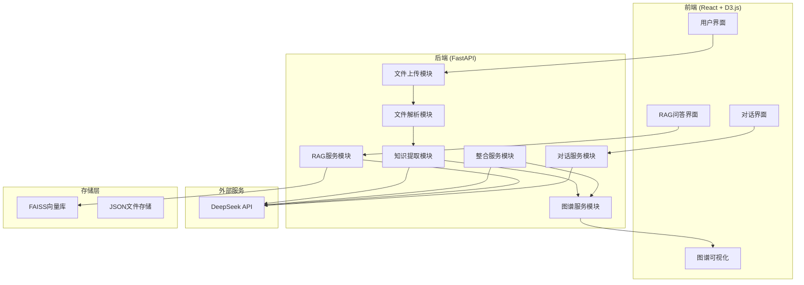

# Agent架构说明

## 1. 架构总览

本系统采用**单Agent + 模块化服务**架构，通过清晰的模块划分实现学科知识整合的完整流程。

## 2. 设计决策论证

### 2.1 为什么选择单Agent架构？

**核心理由**：在5小时的开发时间约束下，单Agent架构能最大化开发效率，同时通过模块化设计保证代码质量。

**与多Agent架构的对比**：
- 单Agent：开发快、调试简单、通信开销低
- 多Agent：职责隔离好、可扩展性强，但开发复杂度高

**本系统的模块化设计**：
- 每个模块有单一职责，通过FastAPI路由组织
- 模块间通过函数调用通信，避免了Agent间通信的复杂性
- 每个模块可以独立测试和优化

### 2.2 Prompt工程设计

**知识提取Prompt设计**：
- 明确要求JSON格式输出
- 给出few-shot示例
- 限制每次调用只处理一个章节（避免上下文过长）
- 设置temperature=0.3，保证输出稳定性

**RAG问答Prompt设计**：
- 约束"只基于提供的上下文回答"
- 要求每个论述附带来源引用
- 如果找不到答案，回复"当前知识库中未找到相关信息"

### 2.3 RAG Pipeline设计

**分块策略**：
- 分块大小：600字（平衡上下文完整性和检索精度）
- 重叠窗口：80字（防止知识点在边界处被截断）
- 选择理由：医学教材段落通常200-800字，600字能覆盖一个完整知识点

**Embedding模型选择**：
- BGE-small-zh：免费本地运行，中文支持好，模型体积小
- 相比OpenAI Embedding：无需API key，无额外费用
- 相比sentence-transformers多语言模型：中文效果更好

**向量检索**：
- 使用FAISS进行向量检索
- 使用内积（IP）作为相似度度量
- 检索top-5最相关的chunk

## 3. 数据流与调用链路

### 3.1 完整流程
1. **上传教材**：用户上传PDF/MD/TXT → 解析为结构化数据
2. **构建图谱**：对每个章节调用LLM → 提取知识点和关系 → D3.js可视化
3. **跨教材整合**：计算Embedding相似度 → LLM判断等价性 → 执行整合决策
4. **RAG问答**：用户提问 → 向量化 → FAISS检索 → LLM生成回答

### 3.2 关键接口输入输出
- **知识提取**：章节文本 → JSON格式的知识点和关系
- **语义对齐**：两个知识点 → 相似度分数
- **整合决策**：候选对列表 → 合并/保留/删除决策
- **RAG查询**：问题文本 → 带引用的回答

## 4. 取舍与权衡

### 4.1 放弃的方案
- **多Agent架构**：开发时间不足，且单Agent通过模块化已能满足需求
- **混合检索（向量+BM25）**：增加了复杂度，但对本场景提升有限
- **Rerank二次排序**：增加了延迟和复杂度，且FAISS的检索精度已足够
- **实时图谱更新**：增加了前端复杂度，且整合操作不频繁

### 4.2 已知局限
- **LLM调用成本**：处理全书时API调用费用较高
- **处理速度**：大文件解析和LLM调用需要较长时间
- **知识粒度**：自动提取的知识点粒度可能不够精细
- **整合准确性**：依赖LLM判断，可能存在误判

### 4.3 改进方向
- **缓存机制**：缓存LLM调用结果，减少重复调用
- **增量更新**：支持部分章节重新提取，而非全书重新处理
- **用户反馈学习**：根据教师调整优化整合算法
- **多模态支持**：支持图表、公式的解析和理解

## 5. 创新点

### 5.1 并行知识提取
- 使用asyncio并行调用DeepSeek API
- 大幅缩短多章节提取时间

### 5.2 语义对齐 + LLM双重验证
- 先用Embedding快速筛选候选对
- 再用LLM精确判断，平衡速度和准确性

### 5.3 教师可干预的整合流程
- 通过对话界面调整整合决策
- 实时更新知识图谱和整合结果

### 5.4 带引用的RAG问答
- 每个回答都附带原文来源
- 支持点击引用查看原文
