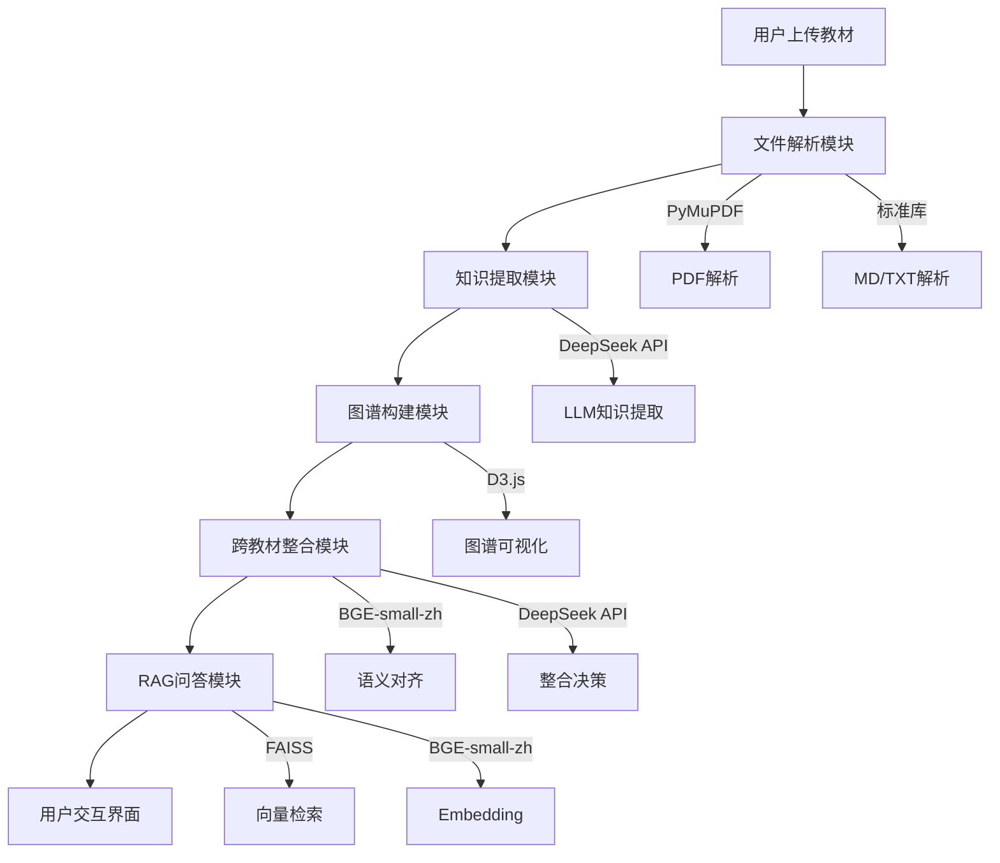

# 系统设计

## 1. 系统架构图



## 2. 数据流

### 2.1 教材上传流程
```
用户上传文件 → 保存到data/uploads/ → 解析为结构化数据 → 保存到data/parsed/
```

### 2.2 知识提取流程
```
读取教材章节 → 并行调用DeepSeek API → 提取知识点和关系 → 保存到data/graphs/
```

### 2.3 跨教材整合流程
```
加载所有知识图谱 → 计算Embedding相似度 → LLM判断等价性 → 执行整合决策 → 保存到data/integration/
```

### 2.4 RAG问答流程
```
用户提问 → 向量化 → FAISS检索top-5 → LLM生成回答 → 返回带引用的答案
```

## 3. 技术选型

| 层级 | 技术 | 选择理由 |
|------|------|----------|
| 后端框架 | FastAPI | 异步支持好，文档清晰，适合快速开发 |
| 前端框架 | React | 生态丰富，组件库多，社区支持好 |
| 知识图谱可视化 | D3.js | 最灵活，力导向图效果最好 |
| 大模型调用 | DeepSeek API | 中文能力强，价格便宜，国内访问快 |
| 向量嵌入 | BGE-small-zh | 免费本地运行，中文支持好 |
| 向量检索 | FAISS | 轻量级，本地运行，无需外部服务 |
| 文件解析 | PyMuPDF | 支持逐页解析，处理大文件效率高 |

## 4. API接口一览

### 4.1 教材管理
- `POST /api/upload/textbook` - 上传教材文件
- `GET /api/upload/textbooks` - 获取教材列表
- `GET /api/upload/textbook/{id}` - 获取教材详情

### 4.2 知识图谱
- `POST /api/graph/build/{id}` - 构建知识图谱
- `GET /api/graph/data/{id}` - 获取图谱数据
- `GET /api/graph/list` - 获取图谱列表

### 4.3 RAG问答
- `POST /api/rag/index` - 构建向量索引
- `POST /api/rag/query` - RAG查询
- `GET /api/rag/status` - 索引状态

### 4.4 跨教材整合
- `POST /api/integration/run` - 执行整合
- `GET /api/integration/result` - 获取整合结果
- `GET /api/integration/report` - 获取整合报告

### 4.5 对话
- `POST /api/chat/message` - 发送消息
- `POST /api/chat/adjust` - 调整整合决策
